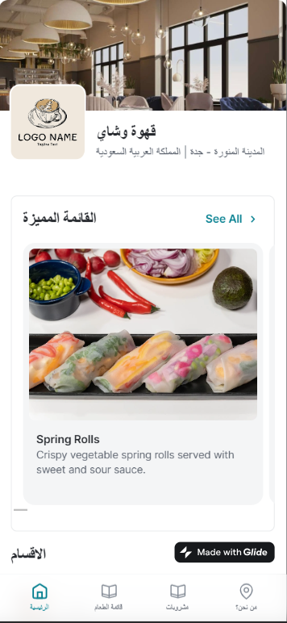

# ResturnatMenuApp

## About the Project:
The "Resturnat Menu App" project was created using the Glide no code application builder. In this project, our main goal was to create an app that would assist Resturnat in showcasing its available and highlighted products, classifying its menu items, and enabling patrons to leave reviews after their meal.

تم إنشاء مشروع "Resturnat Menu App" باستخدام أداة إنشاء التطبيقات Glide no code. في هذا المشروع، كان هدفنا الرئيسي هو إنشاء تطبيق من شأنه أن يساعد مطعم Resturnat في عرض منتجاته المتاحة والمميزة، وتصنيف عناصر القائمة، وتمكين العملاء من ترك التعليقات بعد تناول وجبتهم.

---------------------------------------------------------------------------------

[Click to See the Project⚡️](https://restaurant-menu-baraah.glide.page)
